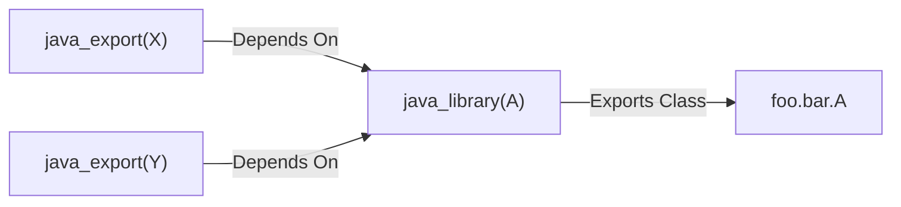
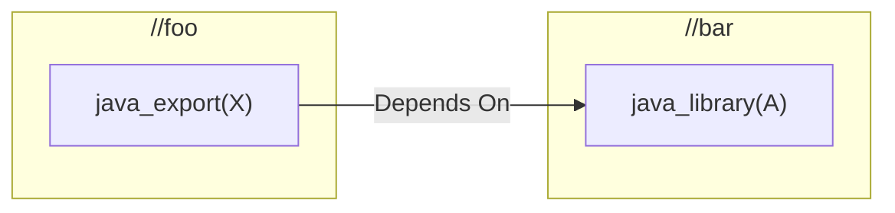

+++
title = 'The Day Gazelle Leaked Its Abstractions - A rules_jvm Story'
date = 2025-11-11
draft = false
tags = ["Bazel", "Gazelle", "rules_jvm"]
+++

Every now and again, I find myself in the mood to test the limits of the Gazelle extension API. As far as abstractions go, I like it!

It's one of those APIs that always seems too simple at first glance, too limited. There's no way this weird thing I need to do will fit neatly into it, right? Right?

Well, it always turns out that yes, indeed, my case _was_ supported and fit in quite well. And no, please, don't break out of the abstractions because it'll mess up with the execution order of Gazelle. Props to the authors, because there always seemed to be a magic parameter of a method that was typed just loosely enough that I could hook into it and do exactly what I need.

That is, until I tackled `java_exports`.

<!--more-->

> Note: This article assumes you're familiar with Gazelle and its extension API. If you're not, I recommend reading [this fantastic primer by Diego aka Kartones](https://blog.kartones.net/post/gazelle-workspace-traversal-and-extension-handlers/). I will be referencing it extensively.
 
# The Problem

Today we're going to talk about [bazel-contrib/rules_jvm#344](https://github.com/bazel-contrib/rules_jvm/issues/344): **Support `java_export` in the Gazelle plugin**, a feature I implemented with sponsorship from the Bazel Rules Authors SIG.

On the surface, it seems like a simple enough task. `rules_jvm_external` has this rule, `java_export`, that represents roughly "an artifact that you're intending to publish". For Bazel purposes, this translates to "A jar + its maven coordinates + sometimes some resources"[^3]

Most large Java repositories publish more than one artifact, and therefore may have one or more `java_export` targets bundling that artifact. Think, for instance, of [all the artifacts under `io-netty`](https://central.sonatype.com/namespace/io.netty). If they were in a Bazel monorepo, each one of those would be a `java_export`.

Before #344, Gazelle would ignore `java_export` targets, which was a problem. For instance, it was possible that the same class would end up in two different published packages if two `java_exports` depended (transitively) on the same `java_library`. You don't want to be debugging the classpath issues caused by this.

So the task was to teach Gazelle to handle `java_export`s in a reasonable way.

Now, "reasonable" is not a very technical term, so we're going to define a couple of concepts to explain the semantics we want:

- We're going to be dealing with `java_library` targets. Whenever I say "target", but not which kind, assume it's a `java_library`.
- We say that target `A` is **inside**  `java_export` `X` if `A` is in the transitive closure of dependencies of `X`.
- Conversely, `A` is **outside** `X` if it is not in the transitive closure of dependencies.
- We're going to say a target **exports** a Java package if that package is accessible to Bazel by depending on that target.

With this, we re-define the problem as:

> If a target _outside_ of a `java_export` would depend on a class _inside_ of a `java_export`, Gazelle should generate a dependency to the `java_export`, instead of whatever target originally _exported_ the needed class.

## Feeling the Edges

Whenever we're trying to generate BUILD files, it pays off to be _extremely_ clear about the semantics we're looking for before we start messing around in Gazelle. Otherwise, we run the risk of thinking that something is working, and then forgetting the bajillion edge cases that will invalidate our solution[^2].

So let's poke the problem a bit to see what ugly corners it has.

### Sharp Edge 1: Nested `java_exports`

Consider the following graph:

Now imagine that we have a `java_library(B)` that would like to import `foo.bar.A`. Should Gazelle generate a dependency on `X`, or `Y`?

After consulting with [Simon](https://github.com/shs96c) (one of the maintainers of `rules_jvm` and the person who requested the feature in the first place), we decided that the answer is `Y`: A target should depend on the most general `java_export` available.
### Sharp Edge 2: Manually maintained `java_exports`

`java_export` targets are usually maintained by hand, because how to partition your classes into publishable artifacts is a design decision which depends on your domain, so it's very hard to automate. Sometimes, the maintainers of a repository decide that they _would_ like the same class to exist in different `java_exports`. I'm sure there are good reasons for this, but for our purposes it leaves us with this case:

If `java_library(B)` would like to import `foo.bar.A`, should it depend on `X`, or `Y`?

After some more chatting, trying out different ideas, and bringing in Steve, the expert on the Gazelle portion of `rules_jvm`, we decided on the pragmatic option: [Just error out](https://github.com/bazel-contrib/rules_jvm/pull/347/files#diff-2564fe0d41f8caa1ece01e294fa68ad6bb94df8255f9b6aa3ce7babba38af718)[^4]

As a fan of Rust, I approve of this strictness.

### Sharp Edge 3: `java_exports` exporting symbols in non-child directories

Imagine the following setup:

It is possible for a `java_export` to export symbols in `java_library` targets that are _not_ in a subdirectory. This has implications for Gazelle, since its traversal order dictates when it has access to what information. This will become extremely relevant in [the following sections](#why-was-this-a-problem-for-gazelle).

# The Solution

We have the problem. We have fleshed out its gnarly edge cases. Let's solve it.

We need to hook into `rules_jvm`'s Gazelle plugin. Specifically, we need to modify the `Resolver`. The main role of the `Resolver` is to map Java packages to Bazel dependencies. In other words: Gazelle asks "I'm about to generate a `java_library`. I know it needs to import the Java package `com.foo.bar`. What Bazel target should it depend on?" and `Resolve` answers with a list of packages. In the `rules_jvm` Gazelle plugin, this question is answered by [`resolveSinglePackage()`](https://github.com/bazel-contrib/rules_jvm/blob/81a007d2009e2e484210f17b88006469dc474adf/java/gazelle/resolve.go#L209).

We need to modify that function so that, if there _is_ a `java_export` that exports the required package and is visible by the target we're trying to create, we should depend on that and exit the function early[^5].

Seems simple, right?

## Why This Is A Problem for Gazelle

Here is a simplified version of what Gazelle does when we run it in a repository[^6]:

1. First, in a phase we'll call `Generate`[^8], it traverses your directory tree trying to figure out "Which targets am I going to create?"[^7]. The traversal will be done **in parallel**, **depth-first**, in **post-order**. So, by the time we get to a parent directory we are guaranteed to know which targets are going to be created in every subdirectory (and, importantly for us, which Java packages they export and which packages they import). It will store this information in an index.
2. Then, in the `Resolve` phase, it will traverse these targets. For each package requested by each target, it will consult the index and come up with a target that offers that package, thus filling out the `deps` field of the target.

Hence, the problem: We have `java_library` targets `A` and `B`, and `java_export` `X`. `B` wants to depend on a package from `A`. In the `Resolve` phase, how do we determine if `A` is inside `X`?

The only way to determine that is to know the transitive closure of dependencies of `X`. How do we figure out that transitive closure? `X` is maintained by hand, so its `deps` are known in step (1). `A`'s `deps`, however, are _generated_ at step (2). But, by the time we're in step (2), there's no guarantee that `B` will be processed _after_ `A`, and therefore by the time we `Resolve(B)` we may not have enough information to determine whether `A` is _inside_ `X`. It gets even worse: `A`, `B`, and `X` might all be in different subtrees, so we don't have a guarantee that `Resolve(A)` will happen before `Resolve(X)`.
## The Solution To The Problem With The Solution

I agonized about this for a while. Was there prior art on this problem? Had anyone faced this issue of needing transitive dependency information at `Resolve` time for arbitrary targets? Turns out: No, apparently this was a new problem. After [discussing](https://bazelbuild.slack.com/archives/C01HMGN77Q8/p1750412735065129) with the community (and [opening an issue](https://github.com/bazel-contrib/bazel-gazelle/issues/2123)), it became apparent that I needed a workaround.

The idea is not complicated: [Build another index](https://github.com/bazel-contrib/rules_jvm/blob/81a007d2009e2e484210f17b88006469dc474adf/java/gazelle/private/java_export_index/java_export_index.go#L62-L82), one that can answer "is this Java package inside a `java_export`?".

How this looks in practice:

- During the `Generate` phase, we collect two pieces of information: What `java_export` targets are to be created (plus their `deps`), and what packages are created by which `java_library` targets ([Source on GitHub](https://github.com/bazel-contrib/rules_jvm/blob/81a007d2009e2e484210f17b88006469dc474adf/java/gazelle/private/java_export_index/java_export_index.go#L98)).
- After the `Generate` phase is done, but before `Resolve` starts, process the index to re-construct the transitive dependency graph and note down which packages are accessible by which `java_export`. We can't do this until `Generate` is complete because of [Sharp Edge 3](#TODO) ([Source on GitHub](https://github.com/bazel-contrib/rules_jvm/blob/81a007d2009e2e484210f17b88006469dc474adf/java/gazelle/private/java_export_index/java_export_index.go#L143)).
- During `Resolve`, we just look at the index to see if we should depend on a `java_export` instead of a `java_library` ([Source on GitHub](https://github.com/bazel-contrib/rules_jvm/blob/81a007d2009e2e484210f17b88006469dc474adf/java/gazelle/resolve.go#L218-L228)).

That's it! [A few thousands of lines of Go code later](https://github.com/bazel-contrib/rules_jvm/pull/347), we had a working implementation.

# The Outcome

It seems that every few months a graph theory problem comes up and makes me bust out the whiteboard. This was one of those problems.

As a result of the work, Gazelle now supports `java_exports`. This support is not free (you can imagine that building a whole separate index is not cheap), and has semantic implications for the repository, so we used [a global directive](https://github.com/bazel-contrib/rules_jvm/blob/main/java/gazelle/README.md#directives) to make the feature opt-in.

However, it does bring some projects (most notably [Selenium](https://www.selenium.dev/)) significantly closer to being able to use Gazelle 🎉

Thank you Simon and Steve for bouncing ideas, and thank you to the [Bazel Rules Author SIG](https://opencollective.com/bazel-rules-authors-sig) for funding this work.

-- Borja

PS: I'm always happy to chat about your build! If you'd like help with your Bazel problems, [get in touch](/enquire).

[^2]: Of course, I only know about this from aquaintances, that would never have happened to me. Never, ever. No, sir.

[^3]: If you're interested in the non-simplified version: [Go to GitHub](https://github.com/bazel-contrib/rules_jvm_external/blob/8ecfd36e4db64257ba2de5c0fb9000dbb4f12c0d/docs/api.md#java_export)

[^4]: One of the reasons it's hard to produce correct results in this case is about traversal order. Gazelle processes directories in parallel, so in the case above it's impossible to tell whether X or Y will be visited first. Yes, we can work around this, but when I tried it the result were 2 or 3x more complicated semantics to support a use case that was dubious to begin with.

[^5]: That's exactly what we did: [Go to GitHub](https://github.com/bazel-contrib/rules_jvm/blob/81a007d2009e2e484210f17b88006469dc474adf/java/gazelle/resolve.go#L218-L228)

[^6]: A fantastic, more complete explanation here: [kartones.net](https://blog.kartones.net/post/gazelle-workspace-traversal-and-extension-handlers/)

[^7]: And what source files do they have, and what packages do they export?

[^8]: It's actually an agglomeration of four phases (`Configure`, `GenerateRules`, `Embeds`, and `Imports`), but the simplification is good enough for our model.
