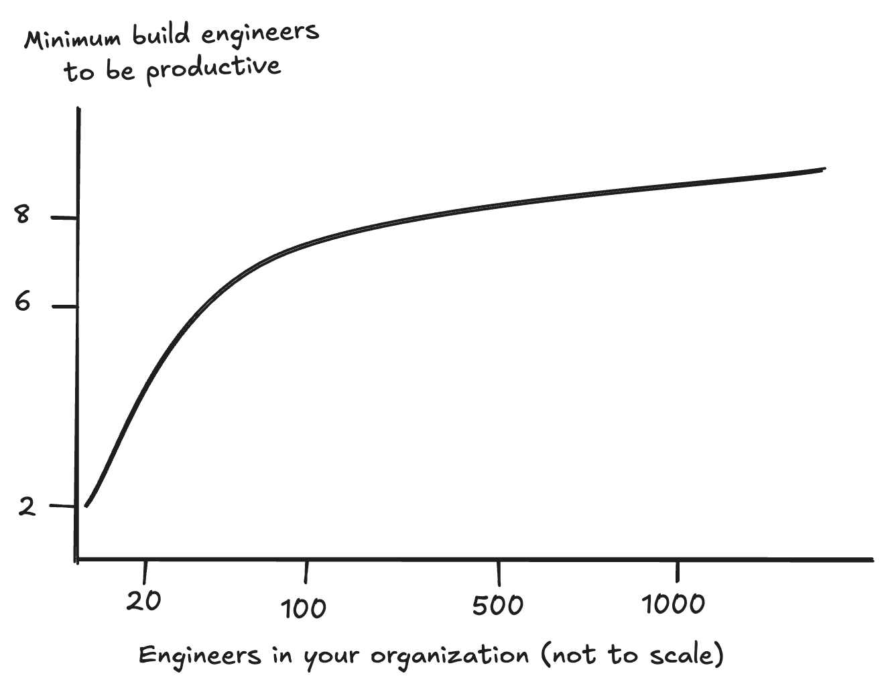

+++
title = 'Bazel Is Not For You'
date = 2026-06-20T09:00:00-08:00
draft = false
tags = ["Bazel", "Opinion"]
+++

I know the title sounds like clickbait, but hear me out.

I make a living helping people with their Bazel builds. My ability to put food on the table is directly correlated with more people using Bazel. I've staked my career in the fact that people need great builds, and that Bazel is a great way to get there.

So please believe that I don't say this lightly: Most organizations shouldn't be using Bazel.

Here's what I've observed, after almost a decade knee-deep in the hermeticity trenches.

## The Big One: You Need At Least 6 People In Your Bazel Team

After working with dozens of teams and organizations, and gathering hundreds of second-hand data points, I observed the following: The teams that struggled with Bazel the most were the smallest ones. This appears pretty obvious, until you couple it with the fact that **this held true, regardless of the overall size of the org they were serving**.

So, a team of 2-4 people struggled to serve 20 engineers just as much as 100, whereas I've seen build teams of 8-10 serve comfortably companies of 1000 engineers. To put it in other words: Bazel's returns on investment are non-linear. Or even better, to put it visually:

This seems to indicate that, **unless you're ready to dedicate a minimum of 5-6 people exclusively to becoming Bazel experts, you're going to have a bad time**, and should probably stick to native tooling.

Which is my main point: Most organizations aren't ready to have 6 full-time Bazel engineers, so they just shouldn't do it.

### Wait, Why Does This Happen?

To be honest, I don't know. I have enough data to say that it _is_ true with confidence, but I only have guesses as to why. 

Anecdotally, it seems to me that:

- There is always a minimum of work involved in keeping the Bazel lights on: You need to make sure the rulesets you depend on are up to date (and contribute fixes if not), you need to keep up with Bazel versions, figure out what the heck to do with protobuf, that sort of thing. This is a constant of work that (1) will probably be unique to your organization, and (2) doesn't really depend on the size of the org.
- You may find yourself maintaining infrastructure. Bazel's promise is that it's so hermetic you can have an artifact cache in the cloud to prevent 80% of your build actions. Well, since you did all the work to migrate, it stands to reason that you should stand up a cache to reap the benefits, right? Well, keeping a live service up is a non-trivial task. Suddenly, you have oncall rotations, and outages, and you need to procure capacity from whoever manages your clusters, etcetera. Build cache services are relatively easy to maintain, but even in the best of days they take a non-trivial amount of overhead[^1].
- You get more customer support requests: Most engineers out there are very comfortable with native tools, and have no idea Bazel exists. When something breaks in `cargo`, their first instinct is usually to Google it, and it's likely they'll find a solution. When something breaks in Bazel, _even if they try to Google it_, chances are they'll end up just reaching out to your team.

So, yeah. Unfortunately, I'd recommend your team be at least 6 tall to ride in the Bazel rollercoaster.

## Your Project Is Mostly In One (Modern) Language, And Your Compile Times Are _Fine For Now_

I hope I don't have to convince you that Bazel is much harder to maintain than any other mainstream, modern build system.

Even further: Despite the recent leaps and bounds made by the Bazel community in usability, I think **it always be harder**. After all, Bazel needs to do exactly the same work (calling the same compiler with the same args as any other build system), but it needs to know about _more stuff_ (e.g., Bazel really cares about which CC toolchain you have installed. Most build systems don't).

So, if your codebase is:
- Mostly in one language,
- compiles from scratch in less than 30 minutes[^2],
- you can set up a brand new development laptop in less than a day, and
- you can be confident that a green test is truly green and not flaky,
 
I'd say just don't bother -- Bazel will probably not transform your build enough to be worth the effort.

Put another way, **Bazel is the best build system to migrate to when you have no other choice**.

## Your IDE Support Will Likely Get Worse

Here's a fact that has become obvious after 10 years in DevEx: Developers care _far more_ about their local environment than they care about CI (and most other things)[^3]. To prove the point, here are two situations I have found in the past:

1. The CI server is so unreliable that 10% of the jobs just failed for no reason, and engineers need to re-start a 2-hour job.
2. Every hour, the IDE just crashes randomly and developers need to take 10 seconds to re-start it.

Most often, (1) will be taken as "par for the course", and may just be joked about in private Slack channels, whereas (2) will have angry developers sending ["friendly pings"](https://goomics.net/191) to your DMs like you cut off the electricty and are holding their PRs hostage.

Unfortunately, IDE support for Bazel has been a huge pain point for as long as I've been in the community. When I was a maintainer of the IntelliJ plugin, I saw first hand the great work and passion of excellent engineers are putting in to bridge this gap. However, the gap remains large, and I'd argue that it will continue to grow. 

So far, there may be 10 or 15 engineers in the world working full time to make IDE support better in Bazel. No matter how good they are, that is just not comparable to the army of engineers working on more mainstream extensions. If Bazel could integrate with existing language servers, this issue would be ameliorated. For now, Bazel will continue to run into the [N+M problem](https://code.visualstudio.com/api/language-extensions/language-server-extension-guide#why-language-server), and IDE support will continue to lag behind the mainstream.

So, if your developers really value their local workflows, please consider that before migrating to Bazel. **There are very few ways to lose developer trust faster than telling them they can't use their favourite editor.**

# Is It All Ash, Then?

"So Borja," you may very reasonably ask. "When _should_ I use Bazel? Surely, you wouldn't stake your career on a build system you know has no use, right?"

Good question! Of course, I think Bazel is a wonderful tool... to solve a certain class of problem. There has been a lot written about [why Bazel](https://bazel.build/about/why) is cool, so I won't elaborate. But TL;DR if your organization:

- Is ready to dedicate around 6 people to a full-time build team,
- Suffers from multi-hour CI builds routinely,
- Needs a lot of language interoperability, or works on old languages without modern tooling support,

Bazel _might_ be a good choice for you. It's still unclear without knowing the specific problems you're trying to solve with Bazel.

If you'd like a second opinion, [get in touch](https://bytebard.software/enquire/?utm_campaign=not-need-bazel)! I'd be very happy to chat about your organization, your problems, and do my best to help you decide. And if you're in the middle of a Bazel migration and find yourself underwater and understaffed, there is hope! This post can be a good tool to secure more headcount.

The important thing is to emphasize that Bazel's problems are the same size, no matter the size of your org. One or two more people can allow you to serve your organization now, _and_ scale the organization to thousands of engineers. You may want to create a slightly more professional-looking graph though.

We'll return to our regularly scheduled tips and tricks soon.

-- Borja

[^1]: Nowadays, there are fantastic services like [Aspect Workflows](https://aspect.build/platform) (or any of the BazelCon sponsors) that will manage a cache for you. While they remove a lot of the heavy lifting and I'd absolutely recommend you consider using one of them, your team will still be on the hook for interfacing with them, and will be ultimately responsible if things break.

[^2]: I pulled this breakpoint out of thin air, and it definitely varies by language. Rust or heavily-templated C++ builds taking 30 minutes is par for the course, whereas a 30min Go build is egregious.

[^3]: I don't want to sound dismissive, because I _also_ care a lot about that. To a fault, some would say. How do you think I ended doing DevEx professionally?
