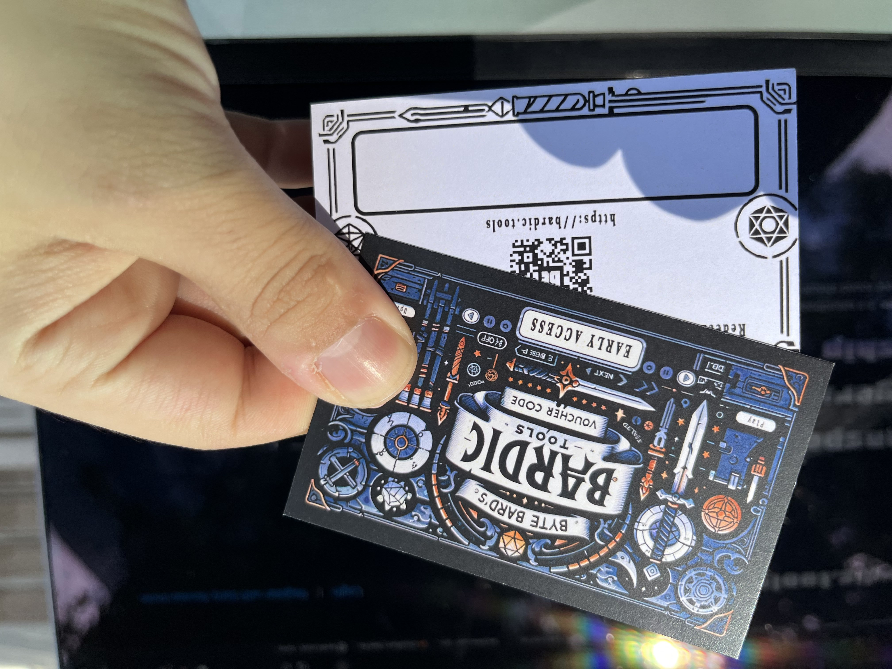

Right, first week with _all the time_ to work on whatever I want!
I worked mostly on [bardic.tools](https://bardic.tools), because it has enough promise that I'm comfortable getting it over the line to the Early Access stage.

I worked on a ton of tech, talked with a bunch of folks, and put in motion one of the coolest marketing pushes I've come across!

So, let's get to it.

# What happened
On the tech side, I:
- Made the music never stop! Until now, the music you were playing would stop if you changed a lane name, sorted the cards, or uploaded a card. No more! Please don't stop the music!
- Implemented a voucher system. That'll be relevant later.
- Implemented a ton of quality of life changes. For example, users can now change their password! Ain't that grand.
- Implemented proper sound storage so that the server doesn't fall over when I have 5 users.

On the marketing side, I braced for a push that I'm probably not ready for: FreeRPG day. Let me tell you a story.

Monday. Here I am, fresh out of my last job, completely energized and pumped to work on [bardic.tools](https://bardic.tools). I hit face-first against the same wall thousands of founders have hit: How do I get the first 10 users?

I want a handful of users to give me feedback and tell me if they product is actually useful, and how to make it the best soundboard ever. The thing is, nobody knows or cares about me or my product. Where do we get the first few users?

Introducing: FreeRPG day.

Turns out, tomorrow RPG stores will be handing out free stuff to players across London. London! I live there!

This seemed like the best opportunity to get a few high-quality customers. 

So I got to designing a handout that I would give to stores, and they could help distribute it for me.

I settled on invitations, so that only people with a code could register for an account. The goal is to accomplish a few things at the same time:
- The invites feel exclusive, as most people don't have access yet.
- It limits the number of users I have. My infra is not 100% scalable for now and, as much as I doubt I'll get a sudden spike of users, I don't want to log in during the weekend to fix stuff.
- I can craft a unique item that people will hopefully love to have.

My fiancee helped me design the vouchers and, one rush order to the printers later, I had a stack of blank vouchers!

Just fill them out with codes, write some copy to let people know what it is and, voila! A very nice handout.

I'm just back from distributing to stores across London. In total, I've distributed some 120 codes, the vast majority going to the fabulous [The Arcanist's Tavern](https://arcaniststavern.uk/).

Every store was very welcoming and open to chatting with a lil' fledgling like myself, and I learned a couple of really useful tips along the way (which I might share in future posts).

Will this net me any users? No clue.

Was it worth it? Heck yeah.

The total cost was £86 for the cards, about £10 in public transportation fees, and about 20 hours of work between production and distribution. In exchange, I got to meet the owners of business where my customers go to shop, which also happen to be really cool people! If I get 10 engaged users out of it, it'll be a great bonus.

I'll post the results next week. Speaking of next week...

# Next Week

Next week will depend a lot on how this push goes. Let's imagine three scenarios:

## If it goes really poorly
If the FreeRPG day promo goes poorly, so I get fewer than 5 signups during the weekend, I need to do some thinking. The goal will be to figure out what went wrong.

Key questions will be:
- Is the product wrong? 
- Is it incomplete?
- Is it the landing page?
- Is it a bug? 
- Is the marketing medium (physically handing out cards) just bad?

If this happens, I'll have conversations about it with the shopkeepers, to see if they have any insights about how the day went, what people are looking for, and so on and so forth.

## If it goes fine
I'd consider this a real success if I get 5 signups during the weekend. That's almost a 5% conversion, which is great for something that you hand out physically.

If this is the case, I'll try to email the users and see what they thought. As I collect feedback, I'll get to planning the next step on this adventure: Getting _paying_ customers. 

Key questions will be:
- What features do I _need_ in order to start charging?
- What features will add significant value, yet I won't _need_ in order to start charging? These are the features I can promise in the "coming soon".
- What pricing models make sense? Which ones are people willing to pay for?

## If it blows my socks off
If I get an overwhelming number of users, the plan will probably look much like in the previous section, except I'll be happier and probably more stress trying to keep the servers up. I'll have to spend some effort on infrastructure before thinking of features.

That's it! See you next week!
